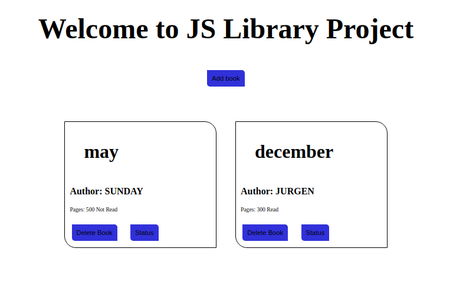

#	PROJECT: LIBRARY


> In this project, a book library was built using Javascript DOM and HTML.




### 📝 Setup

 - Open a terminal
 
 - Copy this code : 
        ```
        git clone git@github.com:jurgen1c/Library.git
        ```

-	Open index.html with live-server


### Build With

-	HTML
- JavaScript
-	SASS  

### Check out the live demo [here](https://rawcdn.githack.com/jurgen1c/Library/f2897184c363e83963dacff870e4ae809098bebf/index.html)     

## 👤 Authors


👤 **Jurgen Clausen Gutierrez**

- Github: [@jurgen1c](https://github.com/jurgen1c)
- LinkedIn: [jurgen-clausen](https://www.linkedin.com/in/jurgen-clausen-2740061a9/)


👤 **Sunday Uche Ezeilo**

- Github: [@sundayezeilo](https://github.com/ezeilo-su)
- Twitter: [@SundayEzeilo](https://twitter.com/SundayEzeilo)
- Linkedin: [Sunday Ezeilo](https://www.linkedin.com/in/sunday-ezeilo-a6a67664/)


## 🤝 Contributing

Contributions, issues and feature requests are welcome!

Feel free to check the [issues page](issues/).

## Show your support

Give a ⭐️ if you like this project!

## Acknowledgments

- Hat tip to anyone whose code was used
- Microverse
- etc

## 📝 License

This project is [MIT](lic.url) licensed.